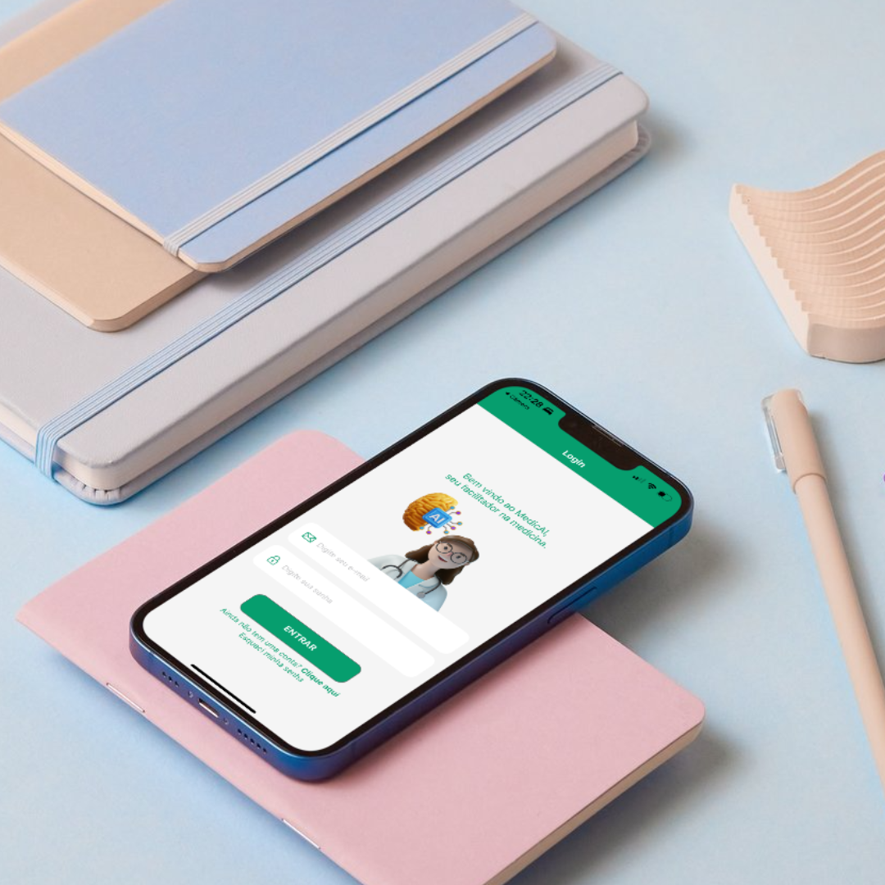

# MedicAI

Repositório base Frontend em React Native de uma aplicação móvel com uso de Grandes modelos de linguagem (GML), que oferece um ambiente para conversação focada em conhecimento da medicina de família e assistência na interpretação e leitura de textos do tipo PDF a fim de agilizar, facilitar e promover o trabalho e estudo de médicos estudantes e médicos formados na área.


.png)

## **Pré-requisitos**

Antes de começar, verifique se você atende aos seguintes requisitos:

- Node.js instalado
- Expo instalado globalmente: `npm install -g expo`

## **Instalação**

Para instalar as dependências do projeto, siga estas etapas:

1. Clone este repositório:
    
    ```bash
    git clone https://github.com/BG-Data/MedicAI_frontend.git
    ```
    
2. Navegue até o diretório do projeto:
    
    ```bash
    cd MedicAI_frontend
    ```
    
3. Uma vez dentro do diretório do projeto, instale as dependências:
    
    ```bash
    npm install
    ```
    

**Importante**: estou trabalhando na **branch develop**, então você precisar mudar para ela ao invés de tentar executar na main.

```bash
git checkout -b develop
```

## **Como Executar**

Para iniciar o aplicativo, siga estas etapas:

1. Execute o comando:
    
    ```bash
    npx expo start
    ```
    
2. Escaneie o código QR exibido com o aplicativo Expo Go no seu dispositivo móvel para carregar o aplicativo nele. Se você utilizar Android, abra o aplicativo Expo Go e realize diretamente nele. Para IOS, você pode utilizar sua câmera app.

Lembre-se que você precisa ter instalado o aplicativo Expo Go no seu Smartphone.(Consulte para mais informações https://expo.dev/tools).

## **Contribuindo**

Se você quiser contribuir para este projeto, siga estas etapas:

1. Faça um fork do projeto
2. Crie sua branch de feature (**`git checkout -b feature/AmazingFeature`**)
3. Faça commit de suas alterações (**`git commit -m 'Add some AmazingFeature'`**)
4. Faça push para a branch (**`git push origin feature/AmazingFeature`**)
5. Abra um pull request

## **Licença**

Este projeto está licenciado sob a Licença MIT - veja o arquivo LICENSE para mais detalhes.

## **Contato**

Se você tiver alguma dúvida ou sugestão, não hesite em entrar em contato! (vale a pena deixar os emails aqui ????? Quer colocar fotinhas nossas de contribuidores hihihihiih)
